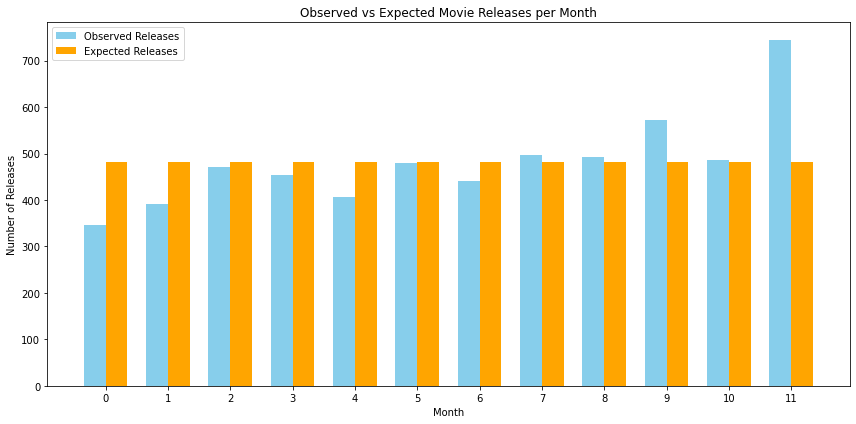
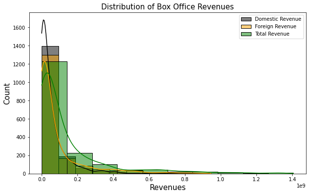
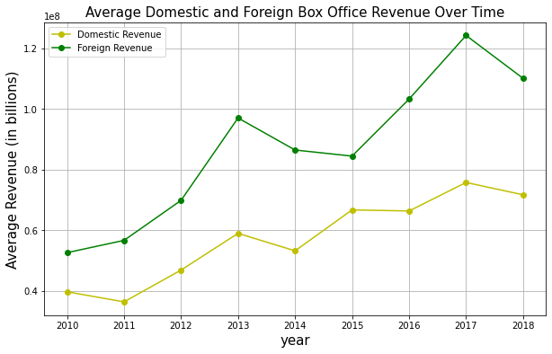
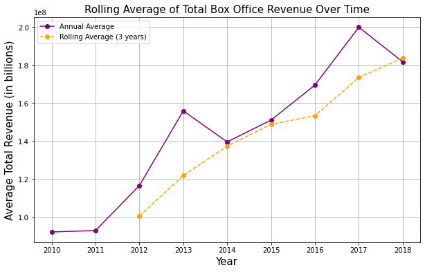

Box Office Movie Analysis
# **Group 9: Box Office Movies Analysis**
# **Project Overview**
This project uses exploratory data analysis to uncover factors driving movie profitability and box office success, providing data-driven insights for a new movie studio's strategy. By examining historical data on production budgets, release timing, genres ,and revenues, we aim to inform decisions on film types, optimal budget allocations, and release schedules, guiding the studio in creating high-performing content.
# **Business Problem**
As major companies invest in original video content, our company has decided to establish a new movie studio to enter the competitive film industry. However, with limited experience in movie production, the company lacks insights into what drives box office success. Our goal is to explore which types of films perform best at the box office, using factors like release timing, production budgets, and profit margins to inform strategic decisions. The insights generated from this an
analysis will support the new movie studio's head in deciding what type of films to create and how to allocate resources effectively for maximum profitability.
## **Objectives** 
1. To identify audience preferences across genres.
2. To explore seasonal trends in movie releases.
3. To determine the profitability of movies based on revenue and profit margins.
4. To determine the change of movie revenue over time.
### Importing Libraries
# import libraries 
import pandas as pd
import matplotlib.pyplot as plt
import numpy as np
import seaborn as sns
import scipy.stats as stats
from scipy.stats import pearsonr
import statsmodels.api as sm
import warnings 
warnings.filterwarnings("ignore", category=FutureWarning)
#### Data Cleaning
Convert Data Types - Ensure numeric columns (e.g., revenue, budget) are correctly formatted.
Handle Missing Values - Drop or impute any necessary columns.
Remove Duplicates
#### EDA
Visualization

#### Statistical Analysis
Testing for Normality
Chi-square Statistic
Regression Analysis
Univariate and Bivariate Analysis
Hypothesis Testing
#### Recommendation
The analysis of movie revenues reveals an overall upward trend in revenue generation over time, indicating growth in the industry and increasing box office performance. This upward trend suggests that audiences are generally spending more on movies, possibly driven by factors such as increased ticket prices, expanded distribution channels, or more frequent high-rate releases.
However, the revenue data also shows periodic volatility. These fluctuations indicate that while the industry is growing,
#### Summary and Recommendations
The studio should consider focusing on high-grossing months (May, June, July,November and December) as these months could yield the greatest profits due to their strong correlation
The analysis of movie revenues reveals an overall upward trend in revenue generation over time, indicating growth in the industry and increasing box office performance. This upward trend suggests that audiences are generally spending more on movies, possibly driven by factors such as increased ticket prices, expanded distribution channels, or more frequent high-rate releases.

However, the revenue data also shows periodic volatility. These fluctuations indicate that while the industry is growing, individual movie performances can vary significantly. Such volatility might stem from seasonal variations, differences in marketing success, shifts in consumer preferences, or the impact of blockbuster releases that temporarily elevate revenue figures.
